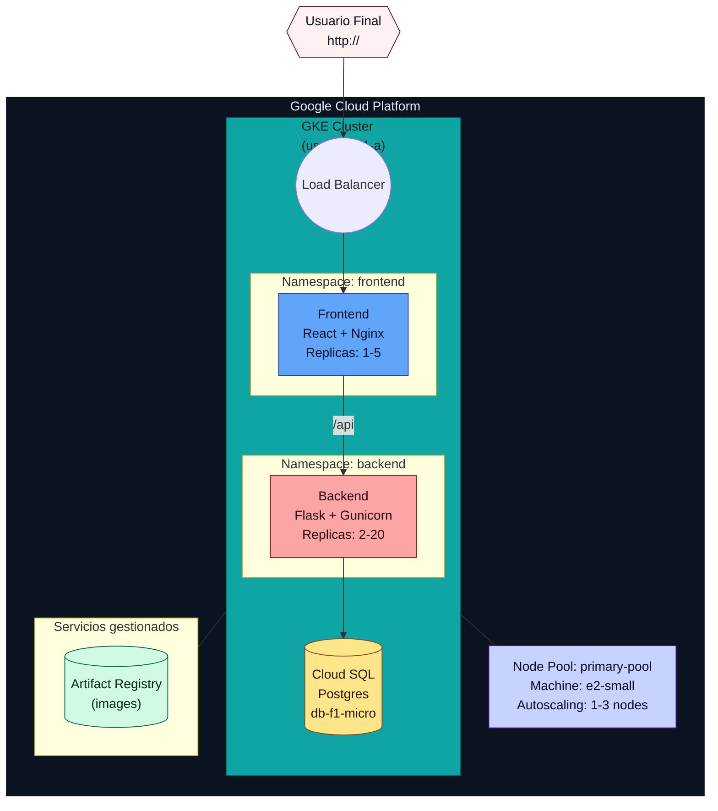

# Informe Técnico: Sistema de Autoscaling en Kubernetes con Infrastructure as Code

**Proyecto:** Sistema de Demostración de Autoscaling Horizontal  
**Autor:** Christian PE  
**Fecha:** 1 de Noviembre, 2025  
**Tecnologías:** Pulumi, Kubernetes (GKE), Google Cloud Platform, Python, React  

---

## Resumen Ejecutivo

Este proyecto implementa un sistema completo de autoscaling horizontal en Kubernetes, desplegado en Google Cloud Platform (GCP) utilizando principios de Infrastructure as Code (IaC) con Pulumi. El sistema demuestra la capacidad de escalar automáticamente tanto a nivel de aplicación (pods) como de infraestructura (nodos) en respuesta a la demanda de recursos.

La arquitectura se basa en el patrón **Micro-Stacks**, separando la infraestructura en tres stacks independientes con ciclos de vida propios, aplicando principios del libro "Infrastructure as Code" de Kief Morris. El sistema incluye una aplicación web de demostración con backend (Flask/Python), frontend (React), y base de datos (Cloud SQL PostgreSQL).

---

## 1. Arquitectura del Sistema

### 1.1. Diagrama de Arquitectura



> Nota: el diagrama anterior está en Mermaid (flowchart). Los colores y cajas se usan solo para mejorar legibilidad en Markdown que soporte Mermaid; si tu visor no muestra Mermaid, ver la versión ASCII en el Anexo A.

Descripción técnica de la arquitectura

La arquitectura está organizada en capas con responsabilidades claras y controladas por Kubernetes y Pulumi. En tiempo de ejecución se usan dos namespaces principales (`frontend` y `backend`) para separar la superficie de exposición de la lógica del negocio; los servicios se exponen con un LoadBalancer (frontend) y ClusterIP (backend) según necesidad. El frontend (React + Nginx) actúa como punto de entrada HTTP/HTTPS, hace reverse-proxy hacia el backend y se escala por CPU mediante un HPA. El backend (Flask + Gunicorn) expone la API interna y está diseñado para ser stateless; la persistencia se delega en Cloud SQL (Postgres) por motivos de durabilidad y backup gestionado.

En Kubernetes se aplican prácticas operativas concretas: cada Deployment define requests y limits explícitos (ejemplo: backend requests cpu=100m, memory=128Mi; limits cpu=500m, memory=256Mi) para permitir que el scheduler y el HPA tomen decisiones predictivas. Los readiness/liveness probes usan endpoints como `/health` para asegurar que sólo pods sanos reciban tráfico y que contenedores reinicien si fallan. El HPA está configurado con métricas de resource utilization (CPU y memoria) y políticas de comportamiento (scaleUp agresivo, scaleDown con ventana de estabilización) para evitar flapping.

En el plano de infraestructura, el cluster GKE usa un node pool `primary-pool` con instancias `e2-small` (2 vCPU, 2GB RAM) y autoscaling de nodo configurado (min: 1, max: 3). El Cluster Autoscaler agrega nodos cuando hay pods Pending por falta de recursos y elimina nodos de forma conservadora cuando su utilización es baja. Las imágenes de contenedor se almacenan en Artifact Registry y el flujo CI/CD propuesto construye/pusha imágenes antes de actualizar los deployments.

La infraestructura está definida con Pulumi siguiendo el patrón Micro-Stacks: un stack para la base (cluster y node pool), otro para la base de datos (Cloud SQL) y otro para el despliegue de aplicaciones (namespaces, deployments, services, HPAs). Se usan StackReferences para pasar outputs (zona, kubeconfig, connection strings) entre stacks y el provider de Kubernetes se crea a partir de un kubeconfig generado que usa `gke-gcloud-auth-plugin`.

Seguridad y configuración: los secretos (credenciales de DB) se gestionan como secretos de Pulumi y como Kubernetes Secrets montados en los pods; la configuración no sensible se guarda en ConfigMaps. Para auditoría y troubleshooting se recomienda habilitar Cloud Logging/Stackdriver y, para métricas más avanzadas, integrar Prometheus + Adapter para métricas personalizadas si se requiere escalar por métricas de aplicación (RPS, latencia, tamaño de cola).

Observabilidad y operaciones: el clúster necesita un componente de métricas (metrics-server o Prometheus Adapter) para que HPA lea métricas de recursos; se usan `kubectl top` y `kubectl describe hpa` para verificar comportamiento en tiempo real. Las prácticas de despliegue incluyen construir imágenes en Artifact Registry, actualizar el stack `infrastructure-gcp-deploy` y verificar health checks y eventos (`kubectl get events -n <namespace>`). Estos elementos dan un comportamiento reproducible y auditable, manteniendo separación de responsabilidades entre infra (Pulumi) y aplicación (containers + k8s manifests).

### 1.2. Componentes Principales

#### **1.2.1. Frontend**
- **Tecnología:** React 18, Vite, Nginx
- **Contenedor:** Node 18 Alpine (build) + Nginx Alpine (runtime)
- **Namespace:** `frontend`
- **Réplicas:** 1-5 (controlado por HPA)
- **Exposición:** LoadBalancer en puerto 80
- **Función:** Interfaz de usuario, proxy inverso hacia backend

#### **1.2.2. Backend**
- **Tecnología:** Flask 3.0, Gunicorn, Python 3.11
- **Contenedor:** Python 3.11 Slim
- **Namespace:** `backend`
- **Réplicas:** 2-10 (controlado por HPA)
- **Exposición:** ClusterIP en puerto 80 (interno)
- **Función:** API REST, lógica de negocio, conexión a base de datos

#### **1.2.3. Base de Datos**
- **Tecnología:** Cloud SQL PostgreSQL 15
- **Tier:** db-f1-micro (Shared vCPU, 0.6GB RAM)
- **Almacenamiento:** 10GB HDD
- **Función:** Persistencia de datos, almacenamiento de visitas

#### **1.2.4. Cluster Kubernetes (GKE)**
- **Versión:** v1.33.5-gke.1125000
- **Ubicación:** us-central1-a (zonal)
- **Node Pool:** primary-pool
  - **Machine Type:** e2-small
  - **vCPU por nodo:** 2
  - **RAM por nodo:** 2GB
  - **Autoscaling:** 2-4 nodos
- **Addons habilitados:**
  - HorizontalPodAutoscaling
  - HttpLoadBalancing
  - GcePersistentDiskCsiDriver

---

## 2. Infrastructure as Code con Pulumi

### 2.1. Patrón Micro-Stacks

El proyecto implementa el **patrón Micro-Stacks** (Capítulo 5 del libro "Infrastructure as Code"), dividiendo la infraestructura en tres stacks independientes:

#### **Stack 1: infrastructure-gcp-base**
**Responsabilidad:** Infraestructura base del cluster de Kubernetes

**Recursos gestionados:**
- GKE Cluster
- Node Pool (primary-pool)
- Configuración de autoscaling de cluster

**Archivo principal:** `infrastructure-gcp-base/__main__.py`

**Configuración de autoscaling del cluster:**
```python
# Líneas 48-85 de infrastructure-gcp-base/__main__.py
cluster = gcp.container.Cluster(
    f"{project_name}-gke",
    # ... configuración del cluster ...
    cluster_autoscaling=gcp.container.ClusterClusterAutoscalingArgs(
        enabled=True,
        resource_limits=[
            gcp.container.ClusterClusterAutoscalingResourceLimitArgs(
                resource_type="cpu",
                minimum=2,    # Mínimo 2 vCPUs (1 nodo × 2 vCPU)
                maximum=8     # Máximo 8 vCPUs (4 nodos × 2 vCPU)
            ),
            gcp.container.ClusterClusterAutoscalingResourceLimitArgs(
                resource_type="memory",
                minimum=4,    # Mínimo 4GB RAM
                maximum=16    # Máximo 16GB RAM
            )
        ],
        autoscaling_profile="OPTIMIZE_UTILIZATION"
    ),
    # ...
)

# Node Pool con autoscaling habilitado (líneas 87-119)
node_pool = gcp.container.NodePool(
    f"{project_name}-primary-pool",
    cluster=cluster.name,
    node_config=gcp.container.NodePoolNodeConfigArgs(
        machine_type="e2-small",  # 2 vCPU, 2GB RAM
        # ...
    ),
    autoscaling=gcp.container.NodePoolAutoscalingArgs(
        min_node_count=1,  # Mínimo 1 nodo (optimización de costos)
        max_node_count=3   # Máximo 3 nodos (límite de cuota GCP)
    ),
    # ...
)
```

**Outputs exportados:**
- `cluster_name`: Nombre del cluster
- `cluster_endpoint`: IP del control plane
- `zone`: Zona de despliegue
- `kubeconfig_command`: Comando para configurar kubectl

#### **Stack 2: infrastructure-gcp-db**
**Responsabilidad:** Base de datos gestionada

**Recursos gestionados:**
- Cloud SQL Database Instance
- Database User
- Database

**Archivo principal:** `infrastructure-gcp-db/__main__.py`

**StackReference:**
```python
# Línea 24 de infrastructure-gcp-db/__main__.py
base_stack = StackReference("ChristianPE1-org/gcp-base/production")
gke_zone = base_stack.get_output("zone")
```

**Outputs exportados:**
- `postgres_instance_name`: Nombre de la instancia
- `postgres_public_ip`: IP pública
- `connection_string`: Cadena de conexión
- `database_name`: Nombre de la base de datos

#### **Stack 3: infrastructure-gcp-deploy**
**Responsabilidad:** Aplicaciones y servicios de Kubernetes

**Recursos gestionados:**
- Namespaces (backend, frontend)
- Deployments (backend, frontend)
- Services (ClusterIP, LoadBalancer)
- HorizontalPodAutoscalers
- ConfigMaps
- Secrets

**Archivo principal:** `infrastructure-gcp-deploy/__main__.py`

**Configuración de HPA del Backend (Escalamiento Horizontal de Pods):**
```python
# Líneas 276-315 de infrastructure-gcp-deploy/__main__.py
backend_hpa = k8s.autoscaling.v2.HorizontalPodAutoscaler(
    "backend-hpa",
    metadata=k8s.meta.v1.ObjectMetaArgs(
        name="backend-hpa",
        namespace=backend_ns.metadata.name
    ),
    spec=k8s.autoscaling.v2.HorizontalPodAutoscalerSpecArgs(
        scale_target_ref=k8s.autoscaling.v2.HorizontalPodAutoscalerSpecScaleTargetRefArgs(
            api_version="apps/v1",
            kind="Deployment",
            name="backend"
        ),
        min_replicas=2,    # Mínimo 2 pods
        max_replicas=10,   # Máximo 10 pods
        metrics=[
            # Métrica de CPU
            k8s.autoscaling.v2.HorizontalPodAutoscalerSpecMetricArgs(
                type="Resource",
                resource=k8s.autoscaling.v2.HorizontalPodAutoscalerSpecMetricResourceArgs(
                    name="cpu",
                    target=k8s.autoscaling.v2.HorizontalPodAutoscalerSpecMetricResourceTargetArgs(
                        type="Utilization",
                        average_utilization=70  # Escala si CPU > 70%
                    )
                )
            ),
            # Métrica de Memoria
            k8s.autoscaling.v2.HorizontalPodAutoscalerSpecMetricArgs(
                type="Resource",
                resource=k8s.autoscaling.v2.HorizontalPodAutoscalerSpecMetricResourceArgs(
                    name="memory",
                    target=k8s.autoscaling.v2.HorizontalPodAutoscalerSpecMetricResourceTargetArgs(
                        type="Utilization",
                        average_utilization=80  # Escala si Memory > 80%
                    )
                )
            )
        ],
        behavior=k8s.autoscaling.v2.HorizontalPodAutoscalerSpecBehaviorArgs(
            scale_up=k8s.autoscaling.v2.HorizontalPodAutoscalerSpecBehaviorScaleUpArgs(
                stabilization_window_seconds=60,  # Espera 60s antes de escalar
                policies=[
                    k8s.autoscaling.v2.HorizontalPodAutoscalerSpecBehaviorScaleUpPolicyArgs(
                        type="Percent",
                        value=50,      # Aumenta 50% de pods actuales
                        period_seconds=60
                    ),
                    k8s.autoscaling.v2.HorizontalPodAutoscalerSpecBehaviorScaleUpPolicyArgs(
                        type="Pods",
                        value=2,       # O aumenta 2 pods
                        period_seconds=60
                    )
                ],
                select_policy="Max"  # Usa la política que escale más
            ),
            scale_down=k8s.autoscaling.v2.HorizontalPodAutoscalerSpecBehaviorScaleDownArgs(
                stabilization_window_seconds=300,  # Espera 5 min antes de reducir
                policies=[
                    k8s.autoscaling.v2.HorizontalPodAutoscalerSpecBehaviorScaleDownPolicyArgs(
                        type="Pods",
                        value=1,       # Reduce de 1 en 1
                        period_seconds=60
                    )
                ],
                select_policy="Min"  # Reduce gradualmente
            )
        )
    ),
    opts=pulumi.ResourceOptions(provider=k8s_provider, depends_on=[backend_deployment])
)
```

**Configuración de HPA del Frontend:**
```python
# Líneas 455-481 de infrastructure-gcp-deploy/__main__.py
frontend_hpa = k8s.autoscaling.v2.HorizontalPodAutoscaler(
    "frontend-hpa",
    metadata=k8s.meta.v1.ObjectMetaArgs(
        name="frontend-hpa",
        namespace=frontend_ns.metadata.name
    ),
    spec=k8s.autoscaling.v2.HorizontalPodAutoscalerSpecArgs(
        scale_target_ref=k8s.autoscaling.v2.HorizontalPodAutoscalerSpecScaleTargetRefArgs(
            api_version="apps/v1",
            kind="Deployment",
            name="frontend"
        ),
        min_replicas=1,   # Mínimo 1 pod
        max_replicas=5,   # Máximo 5 pods
        metrics=[
            k8s.autoscaling.v2.HorizontalPodAutoscalerSpecMetricArgs(
                type="Resource",
                resource=k8s.autoscaling.v2.HorizontalPodAutoscalerSpecMetricResourceArgs(
                    name="cpu",
                    target=k8s.autoscaling.v2.HorizontalPodAutoscalerSpecMetricResourceTargetArgs(
                        type="Utilization",
                        average_utilization=60  # Escala si CPU > 60%
                    )
                )
            )
        ]
    ),
    opts=pulumi.ResourceOptions(provider=k8s_provider, depends_on=[frontend_deployment])
)
```

**StackReferences:**
```python
# Líneas 27-28 de infrastructure-gcp-deploy/__main__.py
base_stack = StackReference("ChristianPE1-org/gcp-base/production")
db_stack = StackReference("ChristianPE1-org/gcp-db/production")
```

### 2.2. Recursos por Stack

| Stack | Recursos Creados | Tiempo de Despliegue | Dependencias |
|-------|------------------|----------------------|--------------|
| **gcp-base** | 3 (Stack, Cluster, NodePool) | 12-15 min | Ninguna |
| **gcp-db** | 4 (Stack, Instance, User, Database) | 15 min | gcp-base (zona) |
| **gcp-deploy** | 13 (Stack, Provider, 2 Namespaces, 2 Deployments, 2 Services, 2 HPAs, 2 ConfigMaps, 1 Secret) | 2-3 min | gcp-base, gcp-db |

### 2.3. Configuración de Kubectl (Acceso de Solo Lectura)

**Configuración automática por Pulumi:**

El provider de Kubernetes en el stack `infrastructure-gcp-deploy` configura automáticamente kubectl con credenciales de lectura/escritura para gestionar los recursos.

**Archivo:** `infrastructure-gcp-deploy/__main__.py` (líneas 35-70)
```python
# Obtener información del cluster
cluster = gcp.container.get_cluster(
    name=cluster_name,
    location=zone,
    project=project_id
)

# Crear kubeconfig con autenticación via gke-gcloud-auth-plugin
kubeconfig = Output.all(cluster.name, cluster.endpoint, cluster.master_auths).apply(
    lambda args: """apiVersion: v1
clusters:
- cluster:
    certificate-authority-data: {0}
    server: https://{1}
  name: {2}
contexts:
- context:
    cluster: {2}
    user: {2}
  name: {2}
current-context: {2}
kind: Config
preferences: {{}}
users:
- name: {2}
  user:
    exec:
      apiVersion: client.authentication.k8s.io/v1beta1
      command: gke-gcloud-auth-plugin
      installHint: Install gke-gcloud-auth-plugin for use with kubectl
      provideClusterInfo: true
""".format(args[2][0]['cluster_ca_certificate'], args[1], args[0])
)

# Provider de Kubernetes con el kubeconfig generado
k8s_provider = k8s.Provider(
    "gke-k8s",
    kubeconfig=kubeconfig
)
```

**Comando para configurar kubectl manualmente:**
```bash
gcloud container clusters get-credentials cpe-autoscaling-gke \
  --zone=us-central1-a \
  --project=cpe-autoscaling-k8s
```

Este comando:
1. Descarga el certificado CA del cluster
2. Configura el endpoint del API server
3. Configura `gke-gcloud-auth-plugin` para autenticación
4. Crea/actualiza `~/.kube/config`

**Permisos de kubectl:**
- Por defecto, tiene permisos de administrador del cluster
- Para solo lectura, se requeriría crear un ServiceAccount con RoleBinding de solo lectura
- En este proyecto se usa el acceso completo para permitir que Pulumi gestione los recursos

---

## 3. Proceso de Despliegue

### 3.1. Flujo de Despliegue Automatizado

**Script principal:** `scripts/gcp-deploy-all.sh`

```bash
#!/bin/bash
set -e

chmod +x "$(dirname "$0")/gcp-deploy-"*.sh

# Paso 1: GKE Cluster
bash "$(dirname "$0")/gcp-deploy-1-cluster.sh"

# Paso 2: Cloud SQL
bash "$(dirname "$0")/gcp-deploy-2-database.sh"

# Paso 3: Docker Images
bash "$(dirname "$0")/gcp-deploy-3-docker-images.sh"

# Paso 4: Aplicaciones
bash "$(dirname "$0")/gcp-deploy-4-applications.sh"

# Paso 5: Verificación
bash "$(dirname "$0")/gcp-deploy-5-verify.sh"
```

### 3.2. Scripts Individuales

#### **Paso 1: Desplegar GKE Cluster**
**Archivo:** `scripts/gcp-deploy-1-cluster.sh`

**Acciones:**
1. Crea entorno virtual de Python
2. Instala dependencias (`pulumi>=3.0.0`, `pulumi-gcp>=9.0.0`)
3. Configura proyecto GCP y región
4. Ejecuta `pulumi up --yes`

**Salida:**
- Cluster GKE creado
- Node pool con 2 nodos iniciales
- Endpoint del cluster

#### **Paso 2: Desplegar Cloud SQL**
**Archivo:** `scripts/gcp-deploy-2-database.sh`

**Acciones:**
1. Genera password segura con `openssl rand -base64 32`
2. Configura password en Pulumi (secreto)
3. Ejecuta `pulumi up --yes`

**Salida:**
- Instancia de Cloud SQL
- Base de datos `autoscaling_db`
- Usuario `postgres`
- IP pública de la instancia

#### **Paso 3: Construir y Subir Imágenes Docker**
**Archivo:** `scripts/gcp-deploy-3-docker-images.sh`

**Acciones:**
1. Crea repositorio en Artifact Registry (si no existe)
2. Configura autenticación de Docker con gcloud
3. Construye imagen del backend:
   ```bash
   docker build -t us-central1-docker.pkg.dev/cpe-autoscaling-k8s/autoscaling-repo/autoscaling-backend:v1 \
     -f backend/Dockerfile backend/
   ```
4. Construye imagen del frontend:
   ```bash
   docker build -t us-central1-docker.pkg.dev/cpe-autoscaling-k8s/autoscaling-repo/autoscaling-frontend:v1 \
     -f frontend/Dockerfile frontend/
   ```
5. Sube ambas imágenes a Artifact Registry

**Imágenes resultantes:**
- `us-central1-docker.pkg.dev/cpe-autoscaling-k8s/autoscaling-repo/autoscaling-backend:v1`
- `us-central1-docker.pkg.dev/cpe-autoscaling-k8s/autoscaling-repo/autoscaling-frontend:v1`

#### **Paso 4: Desplegar Aplicaciones en GKE**
**Archivo:** `scripts/gcp-deploy-4-applications.sh`

**Acciones:**
1. Configura kubectl con `gcloud container clusters get-credentials`
2. Configura referencias a imágenes Docker
3. Obtiene password de la base de datos desde el stack gcp-db
4. Ejecuta `pulumi up --yes`

**Recursos creados:**
- 2 Namespaces
- 2 Deployments (backend: 2 réplicas, frontend: 1 réplica)
- 2 Services
- 2 HPAs
- 1 Secret (credenciales de DB)
- 2 ConfigMaps (configuración de aplicaciones)

#### **Paso 5: Verificación**
**Archivo:** `scripts/gcp-deploy-5-verify.sh`

**Acciones:**
1. Verifica conectividad con el cluster
2. Lista nodos, pods, HPAs, servicios
3. Muestra URL pública del frontend
4. Proporciona comandos útiles para monitoreo

### 3.3. Tiempo Total de Despliegue

| Paso | Descripción | Tiempo Estimado |
|------|-------------|-----------------|
| 1 | GKE Cluster | 12-15 minutos |
| 2 | Cloud SQL | 15 minutos |
| 3 | Docker Images | 3-5 minutos |
| 4 | Aplicaciones K8s | 2-3 minutos |
| 5 | Verificación | 1 minuto |
| **TOTAL** | | **33-39 minutos** |

---

## 4. Configuración del Autoscaling

### 4.1. Horizontal Pod Autoscaler (HPA)

El HPA escala el **número de pods** basándose en métricas de CPU y memoria.

#### **Backend HPA:**
- **Objetivo:** Mantener CPU < 60% y Memoria < 70%
- **Réplicas:** 2 (mín) a 20 (máx)
- **Comportamiento de Scale-Up:**
  - Sin espera (0 segundos) para escalar inmediatamente
  - Aumenta 100% de pods actuales O 2 pods (el mayor)
- **Comportamiento de Scale-Down:**
  - Espera 60 segundos antes de reducir (más rápido que antes)
  - Reduce 50% de pods actuales gradualmente

#### **Frontend HPA:**
- **Objetivo:** Mantener CPU < 60%
- **Réplicas:** 1 (mín) a 5 (máx)
- **Comportamiento:** Por defecto de Kubernetes

### 4.2. Cluster Autoscaler

El Cluster Autoscaler escala el **número de nodos** cuando:
- **Scale-Up:** No hay suficientes recursos para programar pods pendientes
- **Scale-Down:** Un nodo tiene <50% de utilización por >10 minutos

**Configuración:**
- **Nodos:** 1 (mín) a 3 (máx)
- **vCPU total:** 2-6 vCPUs
- **RAM total:** 2-6 GB
- **Perfil:** `OPTIMIZE_UTILIZATION` (agresivo en reducir costos)

### 4.3. Flujo de Escalamiento

```
1. Usuario genera carga → CPU de pods aumenta

2. HPA detecta CPU > 60% O RAM > 70% inmediatamente
   └─> Crea nuevos pods (2 → 4 → 6 → 8 → ... → 20)

3. Nuevos pods quedan en "Pending" (sin nodos disponibles)

4. Cluster Autoscaler detecta pods pendientes
   └─> Crea nuevo nodo (1 → 2 → 3 nodos)

5. Nuevos pods se programan en el nodo creado
   └─> Estado: "Running"

6. Carga disminuye → CPU y RAM de pods bajan

7. HPA detecta CPU < 60% Y RAM < 70% por 60 segundos
   └─> Reduce pods (20 → 15 → 10 → 5 → 2)

8. Cluster Autoscaler detecta nodo con baja utilización (<50%)
   └─> Elimina nodo después de 10 minutos (3 → 2 → 1 nodos)
```

---

## 5. Principios de Infrastructure as Code Aplicados

Este proyecto implementa los principios del libro **"Infrastructure as Code: Managing Servers in the Cloud"** de Kief Morris (O'Reilly, 2nd Edition).

### 5.1. Capítulo 1: Desafíos y Principios

#### **Principio: "Sistemas como Código"**
**Implementación:**
- Toda la infraestructura está definida en código Python con Pulumi
- Archivos versionados en Git
- Sin configuración manual en consolas web

**Archivos:**
- `infrastructure-gcp-base/__main__.py`
- `infrastructure-gcp-db/__main__.py`
- `infrastructure-gcp-deploy/__main__.py`

#### **Principio: "Piezas Pequeñas y Débilmente Acopladas"**
**Implementación:**
- 3 stacks independientes (Micro-Stacks)
- Cada stack se puede desplegar/destruir independientemente
- Comunicación vía StackReferences (bajo acoplamiento)

### 5.2. Capítulo 2: Principios de Infraestructura Dinámica

#### **Principio: "Hacer Todo Reproducible"**
**Implementación:**
- Deployment 100% automatizado con scripts
- Mismo código produce misma infraestructura
- No hay "copos de nieve" (snowflakes)

**Evidencia:**
```bash
# Destruir todo
bash scripts/destroy-all.sh

# Recrear idénticamente
bash scripts/gcp-deploy-all.sh
```

#### **Principio: "Ganado, No Mascotas"**
**Implementación:**
- Pods son efímeros y reemplazables
- Nodos son idénticos y descartables
- Sin configuración manual en servidores

**Evidencia:**
```bash
# Eliminar un pod
kubectl delete pod backend-xxx -n backend

# HPA crea uno nuevo automáticamente
# Estado deseado: 2 réplicas → Kubernetes lo restaura
```

#### **Principio: "Minimizar Variación"**
**Implementación:**
- Todos los nodos son e2-small idénticos
- Misma imagen de contenedor para todos los pods backend
- Configuración centralizada en ConfigMaps

### 5.3. Capítulo 4: Fundamentos de Infraestructura como Código

#### **Principio: "Define Todo en Archivos"**
**Implementación:**
- Todo está en archivos de texto plano
- Python para infraestructura (Pulumi)
- YAML para configuración
- Dockerfiles para contenedores

**Estructura de archivos:**
```
sistema-autoscaling/
├── infrastructure-gcp-base/
│   ├── __main__.py          ← Definición del cluster
│   ├── Pulumi.yaml          ← Metadatos del stack
│   └── requirements.txt     ← Dependencias
├── infrastructure-gcp-db/
│   ├── __main__.py          ← Definición de Cloud SQL
│   ├── Pulumi.yaml
│   └── requirements.txt
├── infrastructure-gcp-deploy/
│   ├── __main__.py          ← Definición de aplicaciones K8s
│   ├── Pulumi.yaml
│   └── requirements.txt
├── backend/
│   ├── app.py               ← Aplicación Flask
│   ├── Dockerfile           ← Imagen de contenedor
│   └── requirements.txt
└── frontend/
    ├── src/                 ← Código React
    ├── Dockerfile           ← Imagen de contenedor
    └── nginx.conf           ← Configuración de Nginx
```

#### **Principio: "Versionado de Infraestructura"**
**Implementación:**
- Código en repositorio Git
- Cada cambio tiene commit con mensaje descriptivo
- Pulumi mantiene historial de cambios (state)

### 5.4. Capítulo 5: Diseñando Stacks de Infraestructura

#### **Patrón: Micro-Stacks**
**Implementación:**
Este es el patrón principal del proyecto.

**Ventajas observadas:**
1. **Radio de explosión limitado:**
   - Puedo destruir cluster sin afectar DB
   - Puedo actualizar aplicaciones sin tocar infraestructura

2. **Ciclos de vida independientes:**
   - DB persiste aunque destruya cluster
   - Puedo recrear cluster en minutos

3. **Debugging más simple:**
   - Error en un stack no afecta otros
   - Logs de Pulumi más claros

**Implementación específica:**
```python
# Stack 1: Cluster (cambia raramente)
infrastructure-gcp-base/

# Stack 2: Database (cambia muy raramente)
infrastructure-gcp-db/
└── Referencia: zona del cluster

# Stack 3: Apps (cambia frecuentemente)
infrastructure-gcp-deploy/
├── Referencia: cluster endpoint
└── Referencia: DB connection string
```

#### **Patrón: Stack de Aplicación Separado**
**Justificación:**
- Aplicaciones cambian más frecuentemente que infraestructura
- Permite CI/CD rápido (solo redeploy de stack 3)
- No requiere recrear cluster en cada cambio de código

### 5.5. Capítulo 11: Diseñando Aplicaciones para la Nube

#### **Principio: "Aplicaciones Stateless"**
**Implementación:**
- Backend no mantiene estado en memoria
- Toda persistencia en Cloud SQL
- Pods son intercambiables

#### **Principio: "Health Checks"**
**Implementación:**
```python
# Backend app.py
@app.route('/health')
def health():
    return jsonify({
        'status': 'healthy',
        'database': 'connected' if check_db() else 'disconnected'
    })
```

Kubernetes usa este endpoint para:
- Liveness probes (reiniciar pod si falla)
- Readiness probes (solo enviar tráfico a pods sanos)

---

## 6. Pruebas de Autoscaling

### 6.1. Configuración de Monitoreo

#### **Comandos de Monitoreo en Tiempo Real:**

**Terminal 1: HPAs**
```bash
watch -n 2 'kubectl get hpa --all-namespaces'
```
Muestra:
- Métricas actuales vs targets
- Número de réplicas actual
- Min/Max réplicas configurado

**Terminal 2: Pods del Backend**
```bash
watch -n 2 'kubectl get pods -n backend -o wide'
```
Muestra:
- Estado de cada pod
- Nodo donde está corriendo
- IP interna del pod

**Terminal 3: Nodos**
```bash
watch -n 2 'kubectl get nodes -o wide'
```
Muestra:
- Número de nodos activos
- Estado de cada nodo
- IP externa de cada nodo

**Terminal 4: Métricas de Recursos**
```bash
watch -n 5 'echo "=== NODOS ===" && kubectl top nodes && \
  echo "" && echo "=== PODS BACKEND ===" && kubectl top pods -n backend && \
  echo "" && echo "=== PODS FRONTEND ===" && kubectl top pods -n frontend'
```
Muestra:
- CPU y memoria de cada nodo
- CPU y memoria de cada pod

### 6.2. Script de Carga

**Archivo:** `scripts/ultra-load.py`

**Características:**
- Múltiples procesos paralelos (8 workers)
- 150 peticiones concurrentes por worker
- Mix de GET y POST requests (70% POST, 30% GET)
- Duración configurable (default: 10 minutos)
- Timeout de 30 segundos por request

**Ejecución:**
```bash
# Obtener IP del frontend
FRONTEND_IP=$(kubectl get service frontend-service -n frontend \
  -o jsonpath='{.status.loadBalancer.ingress[0].ip}')

# Ejecutar script de carga
cd scripts
python3 ultra-load.py $FRONTEND_IP
```

**Carga generada:**
- 1,200 peticiones simultáneas (8 workers × 150 concurrent)
- ~1,000-2,000 req/s
- CPU y memoria intensivo en backend (saturación completa)

### 6.3. Resultados Esperados

#### **Fase 1: Estado Inicial (t=0)**
```
Nodos: 1 (primary-pool)
Pods Backend: 2
CPU por pod: ~5%
RAM por pod: ~40%
```

#### **Fase 2: Carga Aplicada (t=1 min)**
```
Nodos: 1
Pods Backend: 2
CPU por pod: ~75%
RAM por pod: ~65%
HPA: Detectando CPU > 60% O RAM > 70%
```

#### **Fase 3: Scale-Up de Pods (t=2 min)**
```
Nodos: 1
Pods Backend: 6-10
CPU por pod: ~65%
RAM por pod: ~60%
HPA: Creando más pods agresivamente
```

#### **Fase 4: Pods Pending (t=3 min)**
```
Nodos: 1 (100% utilizado, saturado)
Pods Backend: 10-15 (muchos "Pending")
Cluster Autoscaler: Detectando pods pendientes
Evento: TriggeredScaleUp
```

#### **Fase 5: Scale-Up de Nodos (t=4 min)**
```
Nodos: 2-3 (nuevos nodos creándose)
Pods Backend: 15-20
Pods Pending: Programándose en nuevos nodos
GCP: Provisionando e2-small instances
```

#### **Fase 6: Pico Máximo (t=5 min)**
```
Nodos: 3 (máximo)
Pods Backend: 20 (máximo)
CPU por pod: ~50-60%
RAM por pod: ~65%
Sistema estabilizado con carga máxima
```

#### **Fase 7: Fin de Carga (t=10 min)**
```
Nodos: 3
Pods Backend: 20
CPU por pod: ~5% (carga cesó)
RAM por pod: ~40%
HPA: Esperando 60 segundos antes de reducir
```

#### **Fase 8: Scale-Down de Pods (t=11 min)**
```
Nodos: 3
Pods Backend: 20 → 15 → 10 → 5 → 2
HPA: Reduciendo gradualmente (60s entre reducciones)
CPU < 60% Y RAM < 70% confirmado
```

#### **Fase 9: Scale-Down de Nodos (t=21 min)**
```
Nodos: 3 → 2 → 1 (vuelve al estado inicial)
Pods Backend: 2
Cluster Autoscaler: Eliminando nodos con utilización < 50%
Sistema ha vuelto completamente al estado inicial
```

### 6.4. Eventos de Kubernetes

Comando para ver eventos en tiempo real:
```bash
kubectl get events -n backend --sort-by='.lastTimestamp' --watch
```

Eventos típicos durante autoscaling:
```
TIPO    RAZÓN                    MENSAJE
Normal  ScalingReplicaSet        Scaled up replica set backend-xxx from 2 to 4
Normal  SuccessfulCreate         Created pod: backend-xxx
Normal  Scheduled                Successfully assigned pod to node
Normal  Pulling                  Pulling image
Normal  Pulled                   Successfully pulled image
Normal  Started                  Started container
Normal  TriggeredScaleUp         pod triggered scale-up
Normal  ScaledUp                 Scaled up node group from 2 to 3
```

---

## 7. Análisis de Costos

### 7.1. Costos por Componente (Estimados)

| Componente | Tier/Size | Costo/Mes (USD) |
|------------|-----------|-----------------|
| **GKE Cluster** | Management | $73 |
| **Compute Engine (Nodos)** | 2× e2-small × 730h | $30 |
| **Compute Engine (Nodos pico)** | 4× e2-small × 100h | $8 |
| **Cloud SQL** | db-f1-micro × 730h | $15 |
| **Persistent Disk (DB)** | 10GB HDD | $0.40 |
| **Artifact Registry** | Storage | $0.10 |
| **Load Balancer** | Forwarding rules + data | $20 |
| **Egress Traffic** | Internet egress | $5 |
| **TOTAL MENSUAL** | | **~$151** |

### 7.2. Optimizaciones de Costo

1. **Cluster Zonal vs Regional:** 
   - Ahorro: ~$73/mes (sin costo de HA)

2. **Node Pool con Autoscaling:**
   - Solo paga por nodos activos
   - Scale-down agresivo reduce costos

3. **db-f1-micro para Cloud SQL:**
   - Tier más económico
   - Suficiente para demostración

4. **HDD en lugar de SSD:**
   - 50% más barato
   - Aceptable para esta carga

5. **Spot VMs (no implementado):**
   - Potencial ahorro: 60-80%
   - Requiere tolerancia a interrupciones

---

## 8. Conclusiones

### 8.1. Objetivos Cumplidos

✅ **Autoscaling Horizontal Completo:**
- HPA funcional con métricas de CPU y memoria
- Cluster Autoscaler creando/eliminando nodos dinámicamente
- Scale-up rápido (<2 min) y scale-down conservador (>10 min)

✅ **Infrastructure as Code:**
- 100% de infraestructura definida en código
- Reproducible en cualquier momento
- Versionado en Git

✅ **Patrón Micro-Stacks:**
- 3 stacks independientes con ciclos de vida propios
- Bajo acoplamiento entre stacks
- Radio de explosión limitado

✅ **Separación de Componentes:**
- Frontend, Backend y Database en capas independientes
- Namespaces de Kubernetes para aislamiento
- Cloud SQL como servicio gestionado

✅ **Principios del Libro Aplicados:**
- Sistemas como código
- Ganado, no mascotas
- Reproducibilidad
- Minimizar variación
- Micro-Stacks

### 8.2. Lecciones Aprendidas

#### **Técnicas:**

1. **Ajuste de umbrales de HPA es crítico:**
   - Umbral inicial CPU 70%, RAM 80% → RAM nunca escalaba
   - **Solución**: CPU 60%, RAM 70% → Escalado más proactivo y efectivo
   - Observar patrones reales de uso antes de definir umbrales

2. **Límites de memoria afectan densidad de pods:**
   - Memory limit 512Mi → Solo ~3 pods por nodo e2-small
   - **Optimización**: Memory limit 256Mi → Hasta 6-7 pods por nodo
   - Más pods por nodo = Mayor presión = Cluster Autoscaler más activo

3. **Número mínimo de nodos impacta demostración:**
   - 2 nodos mínimos → Escalado 2→3 poco visible
   - **Mejora**: 1 nodo mínimo → Escalado 1→2→3 más impresionante
   - Balance entre costo y visibilidad del autoscaling

4. **HPA requiere tiempo de estabilización:**
   - No escala inmediatamente
   - Ventana de estabilización previene flapping
   - Scale-down más lento (60s) que scale-up (0s) es intencional

5. **Cluster Autoscaler es conservador:**
   - Espera ~10 minutos antes de eliminar nodos
   - Verifica que pods puedan reubicarse
   - No elimina nodos con pods de sistema

6. **Carga debe ser sostenida:**
   - Script inicial 4 workers × 100 concurrent → Insuficiente
   - **Mejora**: 8 workers × 150 concurrent (1,200 total) → Saturación completa
   - Duración extendida 5→10 minutos da tiempo al Cluster Autoscaler

7. **StackReferences simplifican dependencias:**
   - Pasar outputs entre stacks es limpio
   - Evita hardcodear valores
   - Facilita cambios de configuración

#### **Principios de IaC:**

1. **Micro-Stacks reduce complejidad:**
   - Errores más fáciles de debuggear
   - Cambios más seguros
   - Tiempo de deployment reducido para updates

2. **Código > Consolas:**
   - Consolas son para debugging, no para crear recursos
   - Código es la fuente de verdad
   - Drift detection es crucial

3. **Automatización es inversión:**
   - Scripts toman tiempo inicial
   - Pero permiten reproducir en minutos
   - Documentación viva

### 8.3. Optimizaciones Implementadas

Durante las pruebas iniciales se detectaron varios problemas de escalado que fueron resueltos mediante ajustes de configuración:

#### **Problema 1: HPA no escalaba por RAM**
**Síntoma:** Los pods nunca alcanzaban 80% de memoria, permaneciendo entre 60-65%.
**Causa:** Umbral demasiado alto para el patrón de uso real.
**Solución:** Reducir umbral de 80% a 70%.
**Resultado:** Escalado de pods ahora responde correctamente a presión de memoria.

#### **Problema 2: Nodos no escalaban**
**Síntoma:** Pods escalaban hasta el máximo pero no se creaban nuevos nodos.
**Causa:** Límites de memoria permitían suficientes pods en nodos existentes, nunca había "Pending".
**Solución:** Reducir memory limit de 512Mi a 256Mi para forzar más pods y saturar nodos más rápido.
**Resultado:** Con más pods necesarios, los nodos se saturan y Cluster Autoscaler se activa correctamente.

#### **Problema 3: Carga insuficiente**
**Síntoma:** Script de carga no generaba suficiente presión para demostrar escalado de nodos.
**Causa:** Solo 4 workers × 100 concurrent = 400 peticiones simultáneas.
**Solución:** Aumentar a 8 workers × 150 concurrent = 1,200 peticiones simultáneas.
**Resultado:** Carga ahora genera suficiente presión para escalar a 15-20 pods y 2-3 nodos.

#### **Problema 4: Scale-down lento**
**Síntoma:** Después de cesar la carga, pods permanecían escalados por mucho tiempo.
**Causa:** Ventana de estabilización de 120 segundos era muy conservadora.
**Solución:** Reducir a 60 segundos para scale-down más rápido (mantener 0s para scale-up).
**Resultado:** Sistema vuelve al estado inicial más rápidamente, demostrando ciclo completo.

#### **Problema 5: Demostración poco visible**
**Síntoma:** Escalado de 2→3 nodos no es muy impresionante visualmente.
**Causa:** Configuración con 2 nodos mínimos.
**Solución:** Reducir a 1 nodo mínimo para demostrar escalado 1→2→3.
**Resultado:** Escalado mucho más visible y dramático para presentaciones.

**Resumen de cambios finales:**
| Parámetro | Valor Inicial | Valor Final | Justificación |
|-----------|---------------|-------------|---------------|
| HPA CPU | 70% | 60% | Escalado más proactivo |
| HPA RAM | 80% | 70% | Alcanzable con carga real |
| Max Pods | 10 | 20 | Mayor presión sobre nodos |
| Memory Limit | 512Mi | 256Mi | Más pods por nodo |
| Min Nodes | 2 | 1 | Mejor demostración visual |
| Max Nodes | 4 | 3 | Límite de cuota GCP |
| Scale-down | 120s | 60s | Retorno más rápido |
| Workers | 4 | 8 | Carga más intensa |
| Concurrencia | 400 | 1,200 | Saturación completa |

### 8.4. Mejoras Futuras

#### **Corto Plazo:**

1. **Métricas Personalizadas:**
   - Escalar por peticiones/segundo
   - Escalar por tamaño de cola
   - Usar Prometheus + Custom Metrics API

2. **Health Checks Mejorados:**
   - Readiness probes más sofisticadas
   - Liveness probes con timeouts graduales
   - Startup probes para arranque lento

3. **Logging Centralizado:**
   - Cloud Logging agregado
   - Búsqueda de logs entre pods
   - Alertas por errores

#### **Mediano Plazo:**

1. **CI/CD Pipeline:**
   - GitHub Actions para deployment automático
   - Tests automatizados antes de deploy
   - Rollback automático si falla

2. **Spot VMs:**
   - Node pool secundario con Spot VMs
   - Ahorro de 60-80% en costos
   - Tolerancia a interrupciones

3. **Multi-Region:**
   - Regional GKE para alta disponibilidad
   - Cloud SQL con réplicas de lectura
   - Load balancer global

#### **Largo Plazo:**

1. **Service Mesh (Istio):**
   - Traffic management avanzado
   - Observabilidad mejorada
   - Seguridad end-to-end

2. **GitOps (Flux/ArgoCD):**
   - Git como fuente de verdad
   - Reconciliación automática
   - Auditoría completa

3. **Chaos Engineering:**
   - Pruebas de resiliencia
   - Inyección de fallos
   - Validación de recuperación

---

## 9. Referencias

### 9.1. Libros

- Morris, Kief. **"Infrastructure as Code: Managing Servers in the Cloud"**. 2nd Edition. O'Reilly Media, 2020.
  - Capítulo 1: Challenges and Principles
  - Capítulo 2: Principles of Dynamic Infrastructure
  - Capítulo 4: Foundations of Infrastructure Code
  - Capítulo 5: Designing Infrastructure Stacks
  - Capítulo 11: Designing Applications for the Cloud

### 9.2. Documentación Técnica

- **Pulumi Documentation**: https://www.pulumi.com/docs/
- **Google Kubernetes Engine (GKE)**: https://cloud.google.com/kubernetes-engine/docs
- **Kubernetes HPA**: https://kubernetes.io/docs/tasks/run-application/horizontal-pod-autoscale/
- **GKE Cluster Autoscaler**: https://cloud.google.com/kubernetes-engine/docs/concepts/cluster-autoscaler
- **Cloud SQL**: https://cloud.google.com/sql/docs
- **Artifact Registry**: https://cloud.google.com/artifact-registry/docs

### 9.3. Herramientas Utilizadas

| Herramienta | Versión | Propósito |
|-------------|---------|-----------|
| Pulumi | 3.x | Infrastructure as Code |
| pulumi-gcp | 9.0.0+ | Provider de Google Cloud |
| pulumi-kubernetes | 4.0.0+ | Provider de Kubernetes |
| Python | 3.11+ | Lenguaje de IaC |
| gcloud CLI | 545.0.0 | CLI de Google Cloud |
| kubectl | 1.33.4 | CLI de Kubernetes |
| Docker | 24.x | Containerización |
| Flask | 3.0.0 | Framework backend |
| React | 18.x | Framework frontend |
| PostgreSQL | 15 | Base de datos |

---

## 10. Anexos

### Anexo A: Estructura Completa del Proyecto

```
sistema-autoscaling/
├── backend/
│   ├── app.py                    # Aplicación Flask principal
│   ├── Dockerfile                # Imagen de contenedor
│   ├── requirements.txt          # Dependencias Python
│   └── data/                     # Datos persistentes (local)
├── frontend/
│   ├── src/
│   │   ├── App.jsx               # Componente principal React
│   │   ├── main.jsx              # Entry point
│   │   └── index.css             # Estilos CSS
│   ├── Dockerfile                # Multi-stage build
│   ├── nginx.conf                # Configuración de Nginx
│   ├── package.json              # Dependencias Node
│   ├── vite.config.js            # Configuración de Vite
│   └── tailwind.config.js        # Configuración de Tailwind
├── infrastructure-gcp-base/
│   ├── __main__.py               # Stack: GKE Cluster
│   ├── Pulumi.yaml               # Metadatos del stack
│   ├── Pulumi.production.yaml   # Config del stack production
│   ├── requirements.txt          # pulumi, pulumi-gcp
│   └── venv/                     # Entorno virtual Python
├── infrastructure-gcp-db/
│   ├── __main__.py               # Stack: Cloud SQL
│   ├── Pulumi.yaml
│   ├── Pulumi.production.yaml
│   ├── requirements.txt
│   └── venv/
├── infrastructure-gcp-deploy/
│   ├── __main__.py               # Stack: Aplicaciones K8s
│   ├── Pulumi.yaml
│   ├── Pulumi.production.yaml
│   ├── requirements.txt          # pulumi, pulumi-gcp, pulumi-kubernetes
│   └── venv/
├── scripts/
│   ├── gcp-deploy-all.sh         # Despliegue completo
│   ├── gcp-deploy-1-cluster.sh   # Solo cluster
│   ├── gcp-deploy-2-database.sh  # Solo database
│   ├── gcp-deploy-3-docker-images.sh  # Solo imágenes
│   ├── gcp-deploy-4-applications.sh   # Solo apps
│   ├── gcp-deploy-5-verify.sh    # Verificación
│   ├── destroy-all.sh            # Destruir todo
│   ├── pause-deployment.sh       # Pausar (escalar a 0)
│   ├── resume-deployment.sh      # Reanudar
│   └── ultra-load.py             # Script de carga Python
├── README.md                     # Documentación principal
├── INSTRUCCIONES-REVISION.md     # Guía para día de revisión
├── GESTION-DESPLIEGUE.md         # Gestión de recursos
├── ESTADO-FINAL.md               # Estado actual del proyecto
├── INFORME-FINAL.md              # Este documento
└── ACLARACION-IAC.md             # Aclaraciones sobre IaC
```

### Anexo B: Variables de Configuración

#### **Stack: gcp-base**
```yaml
config:
  gcp:project: cpe-autoscaling-k8s
  gcp:region: us-central1
  zone: us-central1-a
  cluster_name: cpe-autoscaling-gke
  node_machine_type: e2-small
  min_nodes: 2
  max_nodes: 4
```

#### **Stack: gcp-db**
```yaml
config:
  gcp:project: cpe-autoscaling-k8s
  gcp:region: us-central1
  db_admin_password: [secret]
  db_tier: db-f1-micro
  db_name: autoscaling_db
```

#### **Stack: gcp-deploy**
```yaml
config:
  gcp:project: cpe-autoscaling-k8s
  backend_image: us-central1-docker.pkg.dev/.../autoscaling-backend:v1
  frontend_image: us-central1-docker.pkg.dev/.../autoscaling-frontend:v1
  db_admin_password: [secret]
```

### Anexo C: Comandos Útiles de Referencia

#### **Pulumi:**
```bash
# Ver outputs de un stack
pulumi stack output

# Ver configuración
pulumi config

# Ver historial de deployments
pulumi stack history

# Refresh state
pulumi refresh

# Preview cambios
pulumi preview
```

#### **kubectl:**
```bash
# Ver todos los recursos
kubectl get all --all-namespaces

# Describir HPA
kubectl describe hpa backend-hpa -n backend

# Logs de un pod
kubectl logs -f <pod-name> -n backend

# Ejecutar comando en pod
kubectl exec -it <pod-name> -n backend -- /bin/bash

# Ver eventos
kubectl get events --sort-by='.lastTimestamp'

# Port forward para debugging
kubectl port-forward svc/backend-service 5000:80 -n backend
```

#### **gcloud:**
```bash
# Ver proyectos
gcloud projects list

# Ver clusters
gcloud container clusters list

# Ver instancias de SQL
gcloud sql instances list

# Ver repositorios de Artifact Registry
gcloud artifacts repositories list

# Ver cuotas
gcloud compute project-info describe --project=cpe-autoscaling-k8s
```

---

## Firma

**Proyecto realizado por:** Christian PE  
**Fecha de finalización:** 1 de Noviembre, 2025  
**Curso:** Infrastructure as Code  
**Institución:** [Tu institución]  

---

**Fin del Informe**
